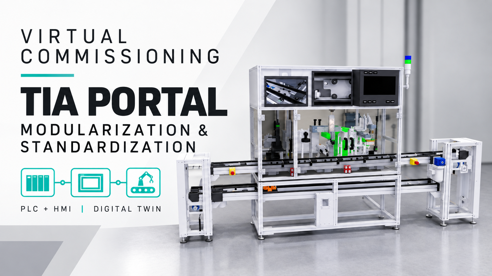
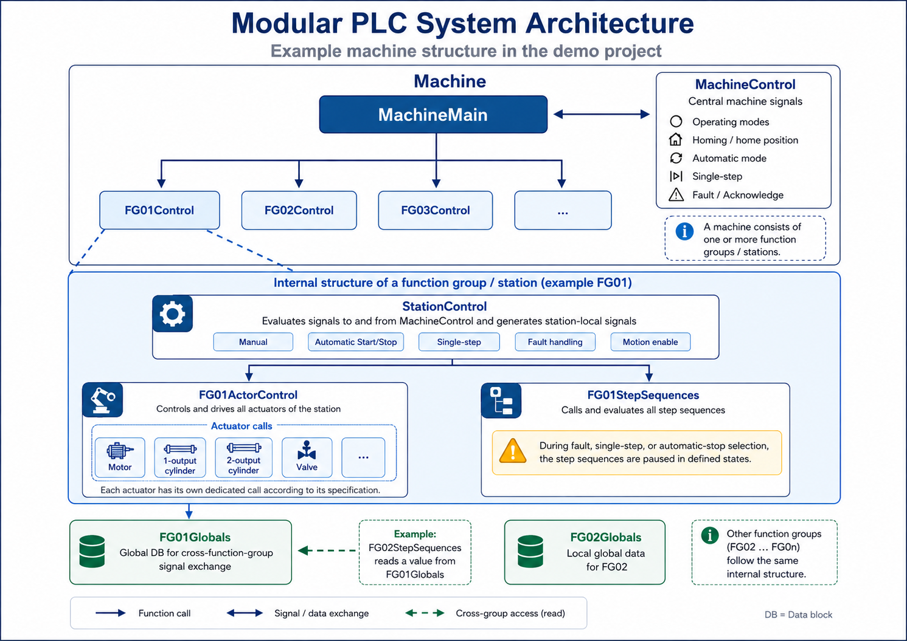
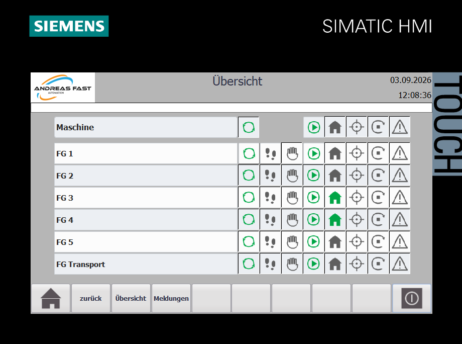
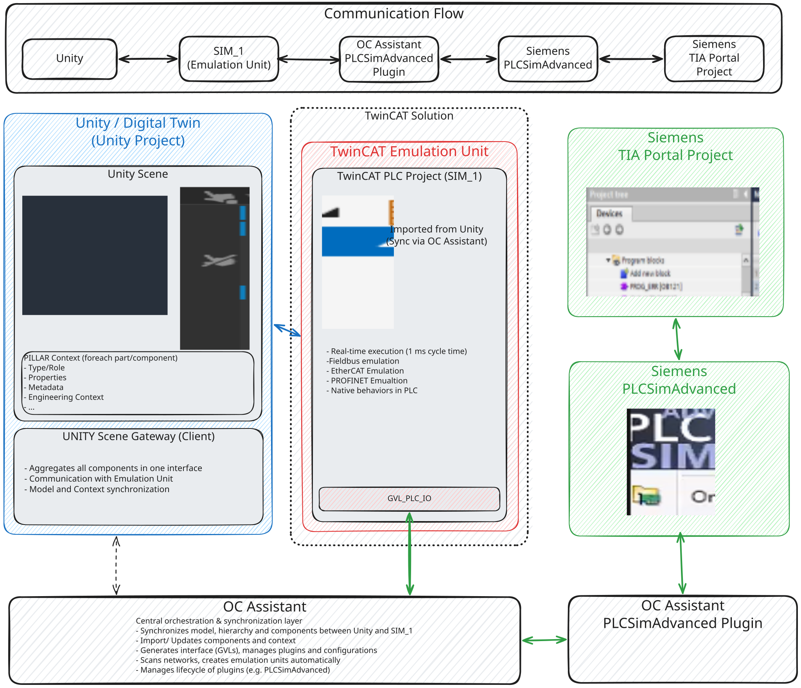

# DT_PSA_OPCV — Siemens PLC & HMI

One machine. Reusable control modules. Virtual commissioning with TIA Portal.

## See it in action

[](https://youtu.be/DnUcnGoN3U8)

[Watch the Siemens walkthrough on YouTube](https://youtu.be/DnUcnGoN3U8): virtual commissioning with TIA Portal, modularization and standardization.

## What is it?

The Siemens implementation of [DT_PSA_OPCV](https://github.com/Preliy/DT_PSA_OPCV) — the Digital Twin for Laser Welding & Assembly System (PSA OPCV).

**Maintained by [Andreas Fast (slickz44)](https://github.com/slickz44).** This repository provides the Siemens PLC/HMI project and emulation files. The digital twin is available as a standalone Windows build; running it does not require Unity or a clone of the main repository.

The focus is **modularization and standardization**: a consistent structure for machine control, station control, actuators, step sequences and HMI operation. Explore the program against a simulated machine and follow how the same control pattern is applied across its function groups.

## Who is it for?

Controls engineers exploring a reusable PLC structure, students learning how machine and station control fit together, and anyone interested in virtual commissioning with Siemens TIA Portal.

## Getting started

**Want to inspect the PLC and HMI project?** [Open the TIA Portal V19 archive](TIA_1/Archive/DT_PSA_OPCV.zap19), select **Download raw file**, then retrieve it in TIA Portal V19.

**Want all Siemens files?** [Download this repository as a ZIP](https://github.com/slickz44/DT_PSA_OPCV_Siemens/archive/refs/heads/master.zip) and extract it.

**Want to run virtual commissioning?** Download the **Windows build – demo launcher** from the [digital-twin releases](https://github.com/Preliy/DT_PSA_OPCV/releases/latest), extract it, run `DT_PSA_OPCV.exe`, select **Siemens** (`VC_Demo_1_Siemens_1`) and click **Start**. Unity is not required. Follow the [Siemens setup guide](_docs/setup.md) to prepare PLCSIM Advanced, start the supplied Beckhoff EmulationUnit in RUN and connect it using OC Assistant with the PLCSIM Advanced plugin.

**Ready to operate the machine?** Follow the [framework guide: first steps and machine startup](_docs/framework.md#first-steps-get-the-machine-running). It explains the operator controls, homing before production, single-step operation and the framework structure for developers.

## Optional: work with the Unity source project

Only if you want to edit the Unity project, clone this module into the main repository's root as `Siemens/`:

```bash
git clone https://github.com/Preliy/DT_PSA_OPCV.git
cd DT_PSA_OPCV
git clone https://github.com/slickz44/DT_PSA_OPCV_Siemens.git Siemens
```

The main repository ignores `/Siemens/`, so the twin and the Siemens module keep their own Git histories. If a `Siemens/` folder already exists, use that checkout rather than cloning over it.

For a download without Git, use **Code → Download ZIP** on each repository. Extract this module into the main project's `Siemens/` folder.

## Download the Siemens project

**[TIA Portal V19 project archive](TIA_1/Archive/DT_PSA_OPCV.zap19)** — on the file page, select **Download raw file**.

The same archive is included when downloading the whole repository as a ZIP. Retrieve it in TIA Portal V19. The engineering software, runtime licenses and required third-party libraries must be installed separately.

## What is here

| Path | Contents |
|---|---|
| `TIA_1/Archive/` | Siemens TIA Portal V19 project archive |
| `TIA_1/EmulationUnit/` | TwinCAT-based emulation project and Open Commissioning connection configuration used with the Siemens environment |
| `_data/` | Existing source material, including PLC tag exports and project/design information |
| `_docs/` | Siemens setup documentation, architecture illustration and demonstration screenshots |
| `_workflow/` | Existing module workflow material and tooling |
| `.github/` | Existing GitHub automation |
| `module.json` | Module identity, version, repository and main-project reference |

`TIA_1/` now contains a Siemens project archive alongside the emulation project. The emulation project uses TwinCAT; the machine control program is supplied in the TIA archive.

## Siemens PLC architecture



The Siemens contribution organizes control into a machine layer and station-level function groups:

- `MachineMain` and `MachineControl` coordinate machine signals, operating modes, homing, automatic operation, single-step operation and fault acknowledgement.
- Function groups organize the individual stations and transport.
- Station control derives local signals for manual operation, automatic start/stop, fault handling and motion enable.
- Actor control provides dedicated calls for the station's motors, cylinders, valves and other actuators.
- Step sequences describe the station process and pause in defined states.
- Function-group data blocks hold station data and support signal exchange between groups.

The architecture illustration explains the intended structure; the retrieved TIA project is the source for its actual implementation.

## HMI operation



The HMI overview shows the machine, function groups FG 1–5 and transport together. It supports inspecting their operating and status indications. The supplied screenshots use German HMI labels.

**Want to add an actuator?** Follow the [manual-operation extension guide](_docs/framework.md#add-an-actuator-and-extend-manual-operation): wire the actuator, initialize its movement entry and configure its HMI setup labels.

## How the tools communicate



The digital twin exchanges simulation data with the TwinCAT **EmulationUnit (SIM_1)**. **OC Assistant** connects the emulation environment to **PLCSIM Advanced** through its **PLCSIM Advanced plugin**. The Siemens control program is engineered in **TIA Portal** and runs in PLCSIM Advanced. Keep OC Assistant running while using this connection.

The diagram also includes Unity project synchronization and engineering functions. These apply when editing the twin; the Windows build contains the prepared Siemens scene.

## Run the project

1. Download this Siemens repository, the digital-twin Windows build, [OC Assistant](https://github.com/OpenCommissioning/OC_Assistant) and its [PLCSIM Advanced plugin](https://github.com/OpenCommissioning/OC_Assistant_PlcSimAdvanced).
2. Copy the unpacked plugin folder into the Assistant's `Plugins` directory, next to `OC.Assistant.exe`.
3. Retrieve the TIA V19 archive, compile the PLC/HMI and load the PLC program into the `DT_PSA_OPCV` PLCSIM Advanced instance.
4. Run `DT_PSA_OPCV.exe`, select **Siemens** and click **Start**.
5. Open `TIA_1/EmulationUnit/EmulationUnit.sln` in TwinCAT and start the EmulationUnit PLC in **RUN**.
6. Start OC Assistant and click **connect** to connect the EmulationUnit solution.
7. Check communication, start the HMI simulation and verify the machine's initial state before operation.

See the [Siemens setup guide](_docs/setup.md) for illustrated instructions and connection settings. The workflow follows the demonstrated setup, including the v1.1.0 Windows launcher; a full clean-install compatibility test across all tool versions has not yet been recorded.
## Relationship to the main project

Machine behavior — sequences, interlocks, fault codes and the reset model — is defined by the main project's [reference documentation](https://github.com/Preliy/DT_PSA_OPCV/tree/master/_docs/reference). This module documents the Siemens implementation of those contracts.

The main project's [compatibility information](https://github.com/Preliy/DT_PSA_OPCV/blob/master/COMPATIBILITY.md) provides the shared compatibility context. The new maintainer URL and tested Siemens/twin version pairing should also be recorded there when coordinated with the main project.

## Roadmap

Planned improvements and ideas for future development:

- **Safety concept:** Extend the machine control and simulation with safety doors and multiple safety circuits.
- **Production counters:** Add daily and shift counters for OK/NOK parts, tracked by product number.
- **Parallel sequences:** Introduce parallel sequence execution to reduce cycle time.
- **Bottleneck analysis:** Identify stations and process steps that limit throughput.
- **Lift drives:** Explore PROFIdrive-based control for the two lifts.
- **Diagnostics:** Extend fault reporting to identify the affected actuators and step sequences.

These topics are open for discussion. Priorities and implementation details may evolve.

## Contributing

Have ideas or experience related to these topics? Suggestions for improving the TIA Portal machine control are welcome. Open an issue or get in touch via [LinkedIn](https://www.linkedin.com/in/automation-fast-andreas/).

## Releases

Releases are published manually with a chosen version and description. Regular pushes update the repository without creating a release. See the [manual release guide](_docs/releasing.md).

## Credits and license

- **[Viktor Gaponenko](https://github.com/Preliy)** — digital-twin expert and creator of the DT_PSA_OPCV simulation. Special thanks for his expertise in digital twins and virtual commissioning, and for providing the simulation environment that brings this Siemens control project to life.
- **Open Commissioning** — digital-twin and emulation framework.

[GPL-3.0](LICENSE). Copyright © 2026 Andreas Fast — Siemens TIA Portal machine control implementation. Existing copyright and license notices for third-party components and the digital-twin project remain with their respective authors.
