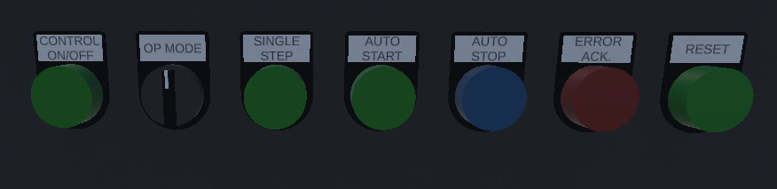
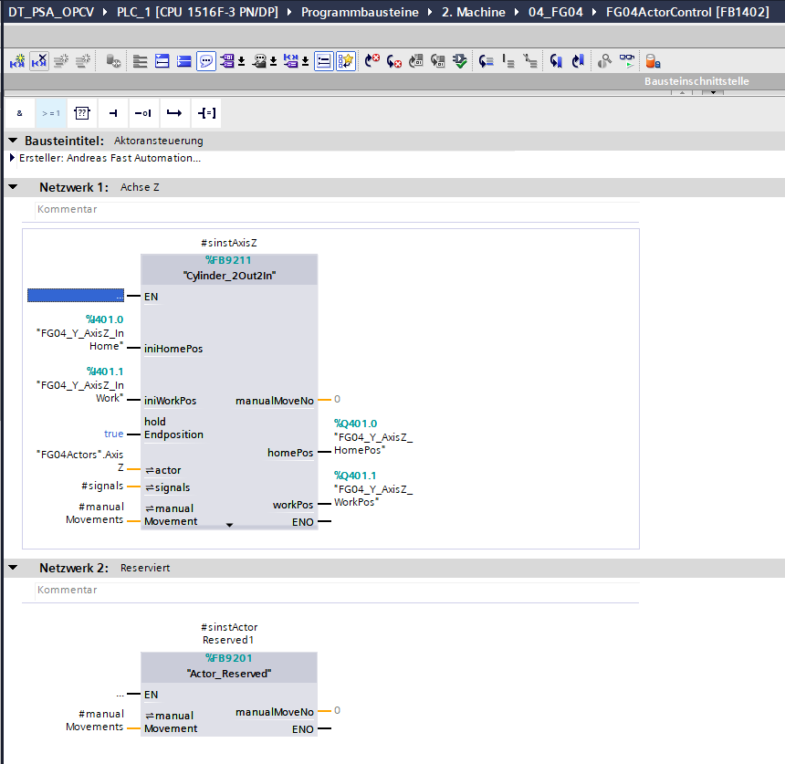
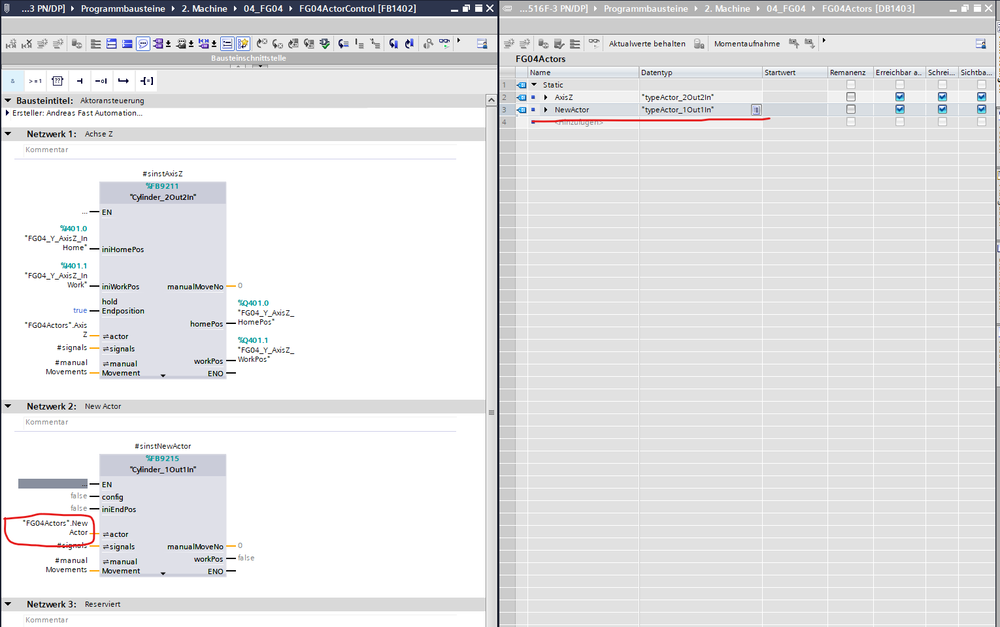
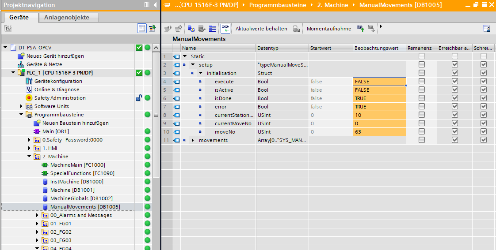
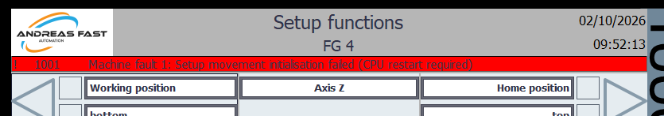
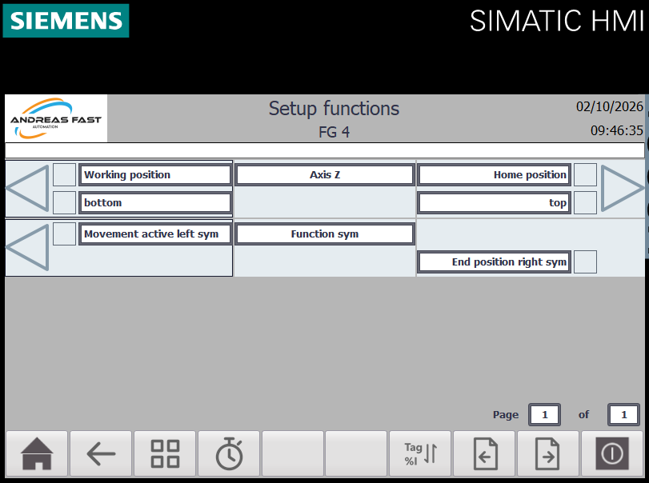
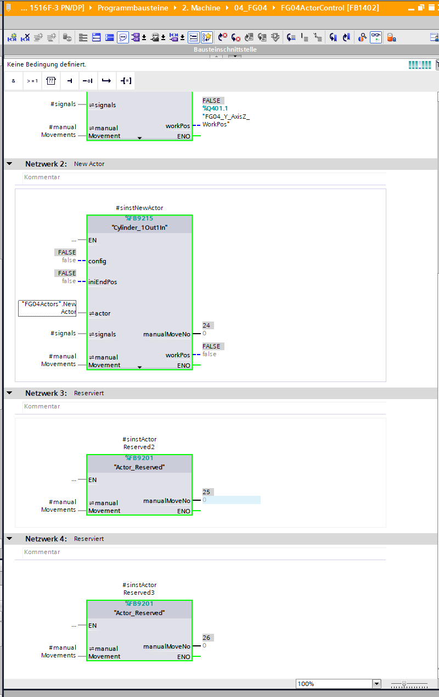
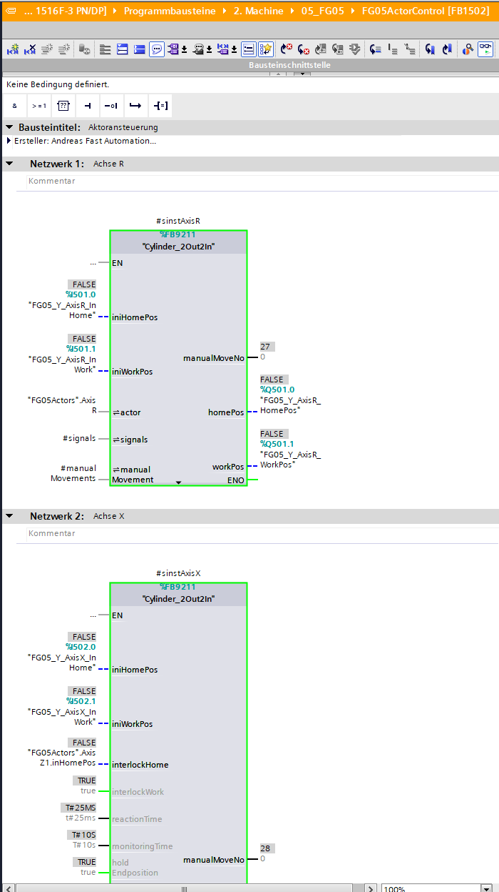
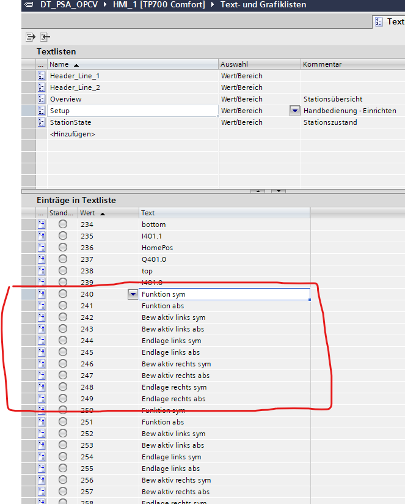
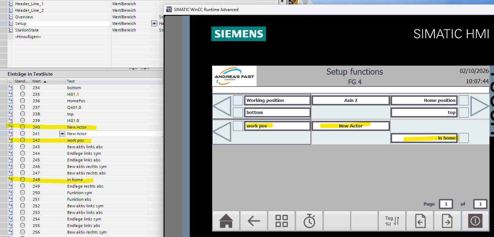

# Siemens machine-control framework

Start here to operate the demo, then explore how the PLC framework connects machine control, stations, actuators and sequences.

## First steps: get the machine running

Complete the [Siemens setup guide](setup.md) first: load the project into the **DT_PSA_OPCV** PLCSIM Advanced instance, put the Siemens CPU and TwinCAT EmulationUnit into **RUN**, connect OC Assistant, open the Siemens digital-twin scene and start the HMI simulation.

For the first startup after the control has been off, use the controls on the machine's operator panel in this order:

| Step | Action | What to observe |
|---|---|---|
| 1 | Switch **CONTROL ON/OFF** on. | The control starts up. Its indicator flashes during startup. |
| 2 | Wait for **CONTROL ON/OFF** to show a steady light. | The configured startup readiness conditions are satisfied. |
| 3 | Turn **OP MODE** to the right to select automatic mode. | On this first switch to automatic after startup, **RESET** flashes: homing is selected. Selecting automatic mode alone does not start motion. |
| 4 | Press **AUTO START**. | The selected homing sequence runs and brings the stations to their home positions. |
| 5 | Wait until **RESET** lights steadily. | All stations are in their home positions. |
| 6 | Press **AUTO START** again. | The automatic production sequence starts, provided the required conditions and releases are satisfied. |

**Reset can select homing manually; Auto Start executes selected homing.** In the startup procedure above, the first start performs homing and the next start begins production. Automatic homing selection depends on the conditions below; switching to automatic mode does not always select a new homing run.

Startup readiness can include functions such as starting external camera computers or enabling the main compressed-air supply and waiting for pressure. These are examples of how the framework can be used; they are not a claim that every such device is implemented in this demo.

## When homing is selected automatically

Station homing is automatically selected only in these cases:

| Trigger | Selection behavior |
|---|---|
| An emergency stop has occurred or the protective circuit has been opened. | Homing is automatically preselected for the stations. |
| The control has been off and the machine is switched to automatic with **OP MODE** for the first time during startup. | Homing is automatically preselected as part of this initial startup. |
| Setup mode was active in a particular station and **OP MODE** is switched back to automatic. | Homing is automatically preselected for that station. This is a station-specific condition. |

Automatic preselection does not initiate motion. **AUTO START** executes the selected homing run once the required conditions are satisfied. **RESET** can also be used to select homing manually.

A normal switch back to automatic without any of these conditions does not by itself preselect homing.

## Controls and indicator meanings

| Control | Function | Indicator meaning |
|---|---|---|
| **CONTROL ON/OFF** | Enables the control and starts the machine startup sequence. | Flashing: startup in progress. Steady: configured readiness conditions met. |
| **OP MODE** | Selects manual or automatic operation; turn right for automatic mode. | Select the required mode before issuing commands. |
| **RESET** | Selects the homing sequence. | Flashing: homing selected. Steady: all stations at home. |
| **AUTO START** | Starts selected homing or automatic production. | Flashing: not all stations are running in automatic operation. |
| **SINGLE STEP** | Executes a single step across the stations in automatic mode. | Lit while the step is executing; goes out once the participating sequences reach `jogdone`. |
| **AUTO STOP** | Requests an orderly stop of automatic production. | Stations continue to their home positions and then stop. |
| **ERROR ACK.** | Acknowledges faults after their causes have been resolved. | Check the HMI alarm list to see which conditions still require attention. |

A lit **SINGLE STEP** indicator means that step execution is in progress, rather than simply indicating a permanently selected mode. Wait for it to go out before requesting the next step.

## Stopping and restarting

### Normal automatic stop

Press **AUTO STOP**. All stations finish their work up to their home positions and remain there. Allow this sequence to complete; this is an orderly process stop.

### Sequence or station fault

The framework handles a sequence fault in stages:

1. The faulty sequence stops in its fault state.
2. Other sequences in the same station continue to their defined wait or hold steps.
3. That station then resets its `releaseCycle`.
4. Other stations continue to their home positions, where their own `releaseCycle` is reset in response to the station or machine fault.

Here, reaching home means completing the applicable sequence to its home position; it is not a separate commanded homing run. Inspect the HMI alarms and the affected sequence before restarting.

### Restart after an emergency stop or an opened protective circuit

After an emergency stop or an opened protective circuit, homing is preselected. Once the relevant condition has been cleared, the protective circuit is closed, automatic mode is selected and the required acknowledgement completed:

1. Press **AUTO START** to execute homing.
2. Wait for all stations to reach home (**RESET** steady).
3. Press **AUTO START** again to start production.

Acknowledgement alone does not restart production. The sequence-fault behavior described above must not be interpreted as the emergency-stop response. This page describes operation of the supplied virtual-commissioning demo.

## How the framework is organized

The framework combines reusable control blocks with station-specific actuator calls and process sequences.

| Component | Responsibility |
|---|---|
| `MachineMain` | Organizes machine control and the function-group calls. |
| `MachineControl` | Reusable library block for machine-wide commands and states: control startup, operating mode, homing, automatic operation, single step and acknowledgement. |
| `FGxxControl` | Station-specific composition of the common functions and the station's own behavior. |
| `StationControl` | Reusable library block that derives station control signals and releases from the machine commands and local conditions. |
| `StationState` | Handles station-state information. |
| `StationCycleTime` | Handles station cycle-time information. |
| `FGxxActorControl` | Groups the calls to the station's actuator blocks. The selection and wiring depend on the station. |
| `FGxxStepSequences` | Groups the station-specific sequence calls; GRAPH sequences describe the process. |

`FGxxControl` follows a common structure but may include additional functions required by a particular station. The reusable elements are `MachineControl`, `StationControl` and the actuator library blocks. The station composition and its sequences are adapted to the application.

“Station-specific” describes the code's purpose, not its PLC block type: for example, `FG01StepSequences` is an FC, while FBs and GRAPH sequences use their associated instance data.

## Manual operation and automatic actuator commands

Every actuator block receives station signals and interfaces to both manual operation and the automatic sequence:

| Interface | Purpose |
|---|---|
| `ManualMovements` | Global DB passed down to the actuator blocks. During initialization, each actuator is assigned its own movement entry. The HMI setup rows use these entries for manual commands and display. |
| `FGxxActors` | Station-specific command and status interface used by the automatic GRAPH sequences and actuator control. It includes actuator commands, feedback, interlocks and fault states. |
| Station signals | Provide the common operating context and station-level releases to the actuator blocks. |

This lets the HMI use a consistent setup interface while each station has its own actuators and automatic process.

### Add an actuator and extend manual operation

This example adds `NewActor` to **FG 4**. It shows how a reusable actuator block connects to the station's application interface and becomes available in the HMI setup functions. The screenshots are from the author's TIA Portal example; German editor labels and English runtime labels refer to the same project.

The workflow is: **insert and wire the actuator → extend `FG04Actors` → compile and download → initialize the movement mapping → edit the HMI texts**. Downloading a new call alone does not complete its registration for manual operation.

#### 1. Insert the actuator call in the station

Open `FG04ActorControl` and choose the library block that matches the actuator. In this example, the existing axis uses `Cylinder_2Out2In`, followed by reserved calls. The first reserved call is replaced with a `Cylinder_1Out1In` call named `sinstNewActor`. Create the corresponding FB instance in the station's actuator-control block, as shown in the example.

*Starting point: an existing actuator provides a wiring reference; the following reserved call is the position used in this example.*

#### 2. Add the application interface and wire the block

In `FG04Actors`, add `NewActor` with the matching interface type, **`typeActor_1Out1In`** for this example. Connect it to the new actuator block's `actor` interface.

| Connection on the new actuator block | Connect to / purpose |
|---|---|
| `actor` | `"FG04Actors".NewActor`: commands and status for use in the application program, including GRAPH sequences. |
| `signals` | `#signals`: the station signals already passed into `FG04ActorControl`. |
| `manualMovement` | `#manualMovements`: the shared `ManualMovements` structure passed down through the station. |
| `iniEndPos` | The end-position feedback appropriate to the actuator. |
| `workPos` | The output signal appropriate to the actuator. |
| `config` | Configuration appropriate to the selected actuator block and application. |

*The red marks connect the two relevant locations: the new DB entry on the right and its connection to `actor` on the left.*

The screenshot demonstrates the interface wiring; `config`, `iniEndPos` and `workPos` still show constant or unconnected values. Complete the actual configuration and physical or simulated I/O assignment for the actuator being added. These illustrative values are not a complete working device connection.

**Use the actuator's `FG04Actors.NewActor` interface in the application program. Do not use absolute input/output addresses directly in step sequences.** Keep I/O assignment at the actuator call; the sequences use the actuator's commands and feedback through its typed interface.

#### 3. Download and initialize the movement mapping

Compile the changed PLC blocks and download them to the CPU. A newly added actuator can still have **`manualMoveNo = 0`** after download: it has not yet been assigned its movement entry.

Run initialization using one of the author's supported methods:

- Restart the CPU so the startup initialization runs.
- Alternatively, trigger `"ManualMovements".setup.initialisation.execute` to request initialization.

The screenshot below shows the initialization structure online. Observe its completion and error status; **`isDone = TRUE` alone does not prove success**. In this screenshot, `error` is also `TRUE`.

The HMI reports an unsuccessful initialization with message **1001**:

> Machine fault 1: Setup movement initialisation failed (CPU restart required)

The message currently names a CPU restart. The explicit initialization request through `setup.initialisation.execute` is the alternative described above. After initialization, verify the result online rather than assuming that downloading the block or acknowledging a message has registered the actuator.

#### 4. Verify the assigned movement and HMI row

After successful initialization in this example:

- The new actuator reports **`manualMoveNo = 24`**.
- Its entry is **`"ManualMovements".movements[24]`**.
- The entry's `attributes.initialised` is `TRUE`, its `stationNo` is `4`, and its station-local `movementNo` is `2` because `NewActor` is the second actuator in station 4.
- The HMI setup functions for **FG 4** include the new actuator row, initially with placeholder texts.

![Online NewActor call reporting manualMoveNo 24 and the corresponding ManualMovements.movements[24] attributes, including initialised TRUE and stationNo 4](images/manual-operation/05-assigned-movement-24.png)

*The lower-left mark highlights the assigned movement number; the right-hand mark highlights its matching DB entry. The existing Axis Z actuator has movement number 23.*

`24` is the movement number and array index used here, not a fixed number to assign to every new actuator. Read the value actually assigned in your project. The screenshot also shows a station-local movement number of `2`; do not confuse that local row number with the global `manualMoveNo` used for the text-list mapping.

*The row is already supplied by the common setup display. Its actuator-specific labels still need to be entered in the HMI text list.*

##### How actuator calls, stations and movement entries are mapped

The aim of this structure is to make adding actuators quick and straightforward: the application developer adds and connects the actuator calls, while initialization registers their manual-operation entries and the common HMI setup display expands accordingly. Actuator-specific HMI texts still need to be maintained as described in the next step.

During initialization, **all actuator calls participating in registration, including reserved placeholder calls, are counted and assigned consecutive entries in the global `ManualMovements` DB**. The global `manualMoveNo` continues across station boundaries. Each entry also identifies its station and its station-local `movementNo`.

The screenshots illustrate the following sequence:

| Station | Actuator / placeholder | Global `manualMoveNo` and DB entry | Position within the station |
|---|---|---|---|
| FG 4 | Axis Z | `23` → `movements[23]` | First actuator |
| FG 4 | NewActor | `24` → `movements[24]` | Second actuator; `movementNo = 2` |
| FG 4 | Reserved placeholder 2 | `25` → `movements[25]` | Third slot (reserved) |
| FG 4 | Reserved placeholder 3 | `26` → `movements[26]` | Fourth slot (reserved) |
| FG 5 | Axis R | `27` → `movements[27]` | First actuator of the next station |
| FG 5 | Axis X | `28` → `movements[28]` | Second actuator of the next station |

**This HMI panel displays four setup rows per page.** FG 4 therefore retains two `Actor_Reserved` calls after Axis Z and NewActor. They occupy movement entries 25 and 26, keeping the next station's Axis R assigned to movement number **27**. Number 27 is its global setup movement number, not the 27th visible row on one HMI page.

*The two reserved calls participate in registration just like allocated slots. They preserve space in FG 4 so that the following station's numbering remains unchanged in this extension.*

*Registration continues across the station boundary: FG 4 ends at 26 and FG 5 starts at 27.*

When replacing a reserved call with a real actuator, keep its position in the call sequence and initialize the mapping again. In this example, NewActor replaces the former reserved slot at 24; the remaining placeholders preserve the subsequent assignments. Adding or removing calls without preserving those slots can shift the movement numbers of following actuators and their associated HMI text-list groups.

The framework **automatically calculates the number of available HMI setup pages**. The developer does not manually set the page count for each added actuator. Initialization provides the movement mapping, the common HMI displays the station's setup functions, and the `Setup` text list supplies the labels. The four-row page layout is specific to the panel configuration shown here.

#### 5. Set the HMI labels in the Setup text list

In the HMI project, open **Text and graphic lists → Text lists → Setup** (`Text- und Grafiklisten → Textlisten → Setup` in the German editor).

Each movement uses a group of ten text-list values. For movement number **24**, edit **240–249**:

**Text-list base value = `manualMoveNo × 10`**

| Value | Label represented by the entry |
|---|---|
| `240` | Function name, symbolic display |
| `241` | Function name, absolute display |
| `242` | Left movement active, symbolic display |
| `243` | Left movement active, absolute display |
| `244` | Left end position, symbolic display |
| `245` | Left end position, absolute display |
| `246` | Right movement active, symbolic display |
| `247` | Right movement active, absolute display |
| `248` | Right end position, symbolic display |
| `249` | Right end position, absolute display |

Adapt the applicable entries to the actuator and maintain the runtime languages you use. The block's movement attributes determine which controls and indications are displayed; not every actuator uses every field. Absolute-display labels are HMI text entries and do not change the rule to use the actuator interface rather than absolute I/O in the sequence code.

In the illustrated result, `240` and `241` contain **New Actor**, `242` contains **work pos**, and `248` contains **in home**. These are example labels for the demonstrated configuration; choose names that match your actual actuator and feedback.

Compile and transfer the HMI changes, or rebuild/restart the HMI simulation as appropriate, then check the resulting row.

*The highlighted text-list entries on the left correspond to the highlighted labels in the setup row on the right.*

#### 6. Check the extension

Before using the new actuator in automatic sequences, verify:

- The block has the intended configuration, I/O and station-signal connections.
- `FG04Actors.NewActor` uses the interface type expected by the actuator block.
- Initialization completes without an initialization error; `manualMoveNo` is assigned and the matching movement entry is initialized for FG 4.
- The HMI row appears under the correct station with meaningful labels for the assigned movement number.
- In manual/setup operation, the command, actuator response and feedback agree, subject to the configured releases and interlocks.
- The automatic application accesses `FG04Actors.NewActor`, not the physical I/O directly.

If actuator calls are added, removed or reordered later, recheck the assigned movement numbers and their HMI text groups after initialization.

| Observation | Check |
|---|---|
| New actuator still reports `manualMoveNo = 0` | Run initialization after the PLC download and check its status. |
| `isDone = TRUE`, but `error = TRUE` or HMI message 1001 remains | Initialization was not successful. Check the new call's wiring, its participation in initialization and the movement registration. |
| Row appears with texts such as `Function sym` | Edit the `Setup` text-list group for the assigned movement number, then update the HMI runtime. |
| Correct row number but labels describe another actuator | Compare the actual `manualMoveNo` with the text-list group; in this example, 24 maps to 240–249. |
| Row exists but the actuator does not respond | Check manual/setup selection, station releases, actuator configuration, interlocks and actual I/O assignment. |

## Communication between stations

`FGxxGlobals` provides signal exchange between function groups. The current implementation does **not** enforce a strict rule that only the owning station writes to its globals.

For example, the workpiece-carrier lifts belong to `FGTransport`. Transport sets a `release` when a carrier has been lifted and is ready for a station. The station performs its work and resets that release in `FGTransport` when finished. When extending this handshake, account for both writers and the order of the PLC calls.

## Where developers should start

1. Run the machine with the first-start procedure above and observe the panel and HMI states.
2. Open `MachineMain` and follow the `MachineControl` call to understand the machine-wide commands.
3. Inspect one function group, such as `FG01Control`, including `StationControl`, `StationState` and `StationCycleTime`.
4. Trace one actuator through `FG01ActorControl`, its `ManualMovements` entry and its interface in `FG01Actors`.
5. Follow the matching GRAPH sequence in `FG01StepSequences`, including its transitions, wait/hold steps and home state.
6. Inspect the station's exchange with `FGTransport` before changing cross-station releases.

This guide documents the behavior and structure described by the framework author. Check the downloaded TIA project's implementation when making changes. Planned additions are listed in the [roadmap](../README.md#roadmap).

## If the machine does not start

| Observation | Check |
|---|---|
| Control indicator keeps flashing | Startup readiness conditions and HMI messages. |
| Reset flashes but there is no motion | Homing is selected; use **AUTO START** to execute it. |
| Reset is steady after the first start, but production has not begun | Press **AUTO START** again for production. |
| Auto Start flashes | Not all stations are running automatically; inspect their states, alarms and releases. |
| Single Step stays lit | A participating sequence has not yet reached `jogdone`; inspect its active step and transition conditions. |
| No communication or no actuator response | Follow the [setup troubleshooting checks](setup.md#troubleshooting), especially the exact PLCSIM instance name and OC Assistant connection. |

[Back to the README](../README.md) · [Setup guide](setup.md) · [Watch the demonstration](https://youtu.be/DnUcnGoN3U8)
