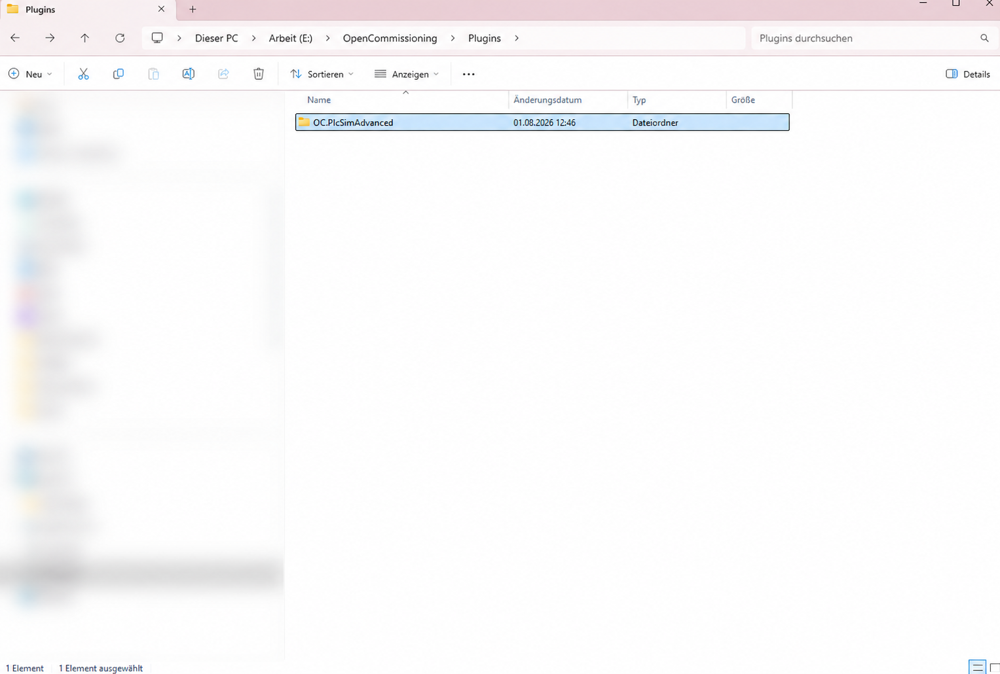
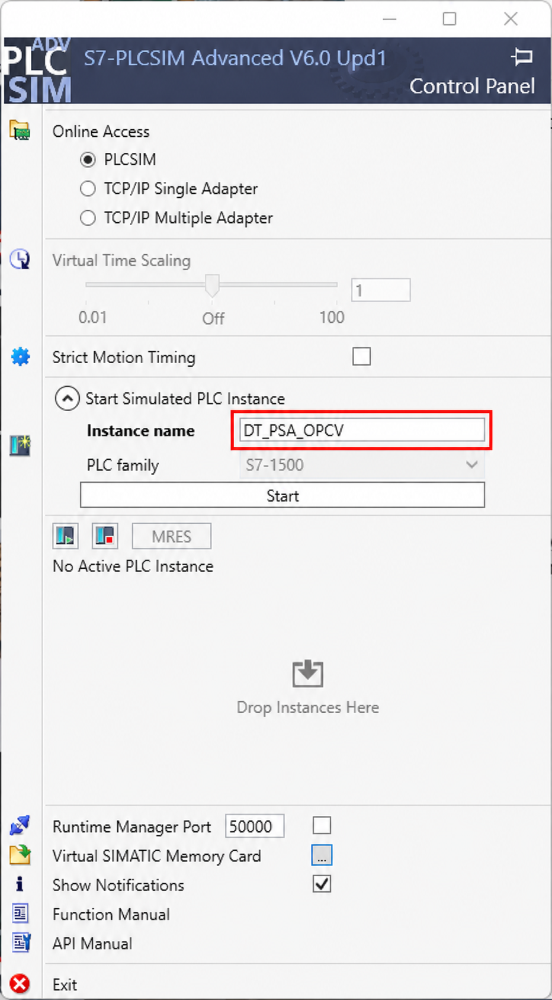
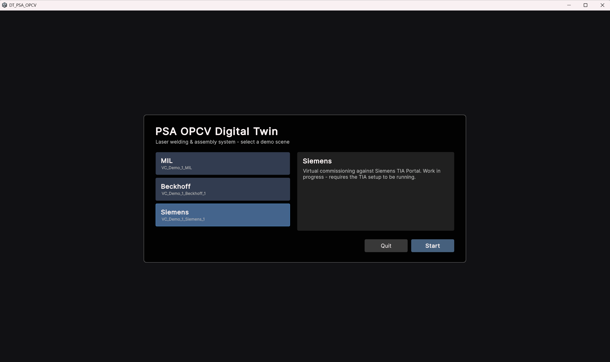
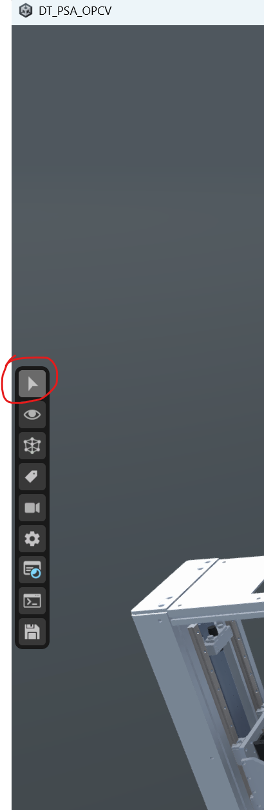
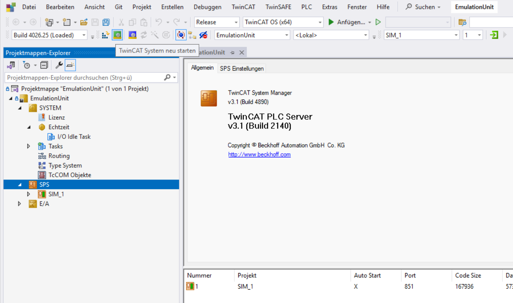
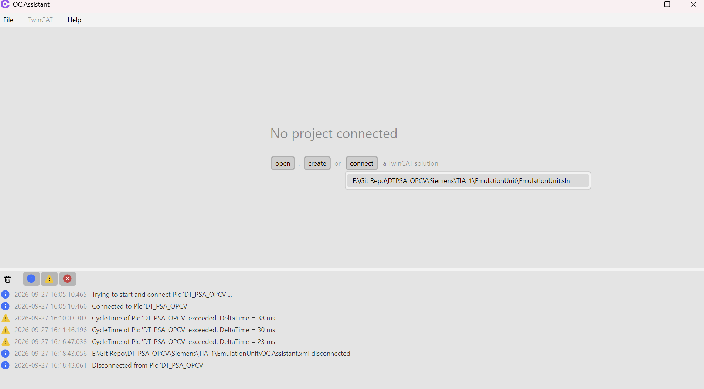

# Siemens setup guide

Run the digital twin as a Windows application and connect the Siemens PLC/HMI project through TwinCAT and Open Commissioning. **Unity and a clone of the main digital-twin repository are not required to run the Windows build.**

## How the tools communicate


The runtime communication chain shown in the diagram is:

**Digital twin ↔ TwinCAT EmulationUnit (SIM_1) ↔ OC Assistant / PLCSIM Advanced plugin ↔ PLCSIM Advanced.**

TIA Portal configures, compiles and downloads the Siemens control program into PLCSIM Advanced. The EmulationUnit provides simulation-side behavior and interfaces. OC Assistant manages the plugin connection that lets the simulated Siemens PLC exchange data with this environment. Keep the Assistant running during virtual commissioning.

The diagram also shows engineering functions such as importing components and synchronizing a Unity project. These apply when editing the twin; the Windows build already contains the prepared Siemens scene.

## 1. Download and prepare the tools

| Component | What to obtain |
|---|---|
| Siemens project and EmulationUnit | [Download this repository as a ZIP](https://github.com/slickz44/DT_PSA_OPCV_Siemens/archive/refs/heads/master.zip) and extract it |
| Digital twin | [Windows build – demo launcher](https://github.com/Preliy/DT_PSA_OPCV/releases/latest), under **Assets**; choose the Windows build rather than **Source code** |
| OC Assistant | Follow the Assistant download link in [OC_Assistant](https://github.com/OpenCommissioning/OC_Assistant) |
| PLCSIM Advanced plugin | Obtain the plugin from [OC_Assistant_PlcSimAdvanced](https://github.com/OpenCommissioning/OC_Assistant_PlcSimAdvanced) |
| Siemens tools | TIA Portal V19, PLCSIM Advanced and the WinCC components required by the project |
| Beckhoff tools | TwinCAT engineering/runtime environment and the EmulationUnit's referenced libraries, including [OC_Core — download and installation](https://github.com/OpenCommissioning/OC_TwinCAT_Core) |

Engineering software and runtime licenses are obtained separately.

The demonstration shows **PLCSIM Advanced V6.0 Update 1**, a **TIA V19** archive and **TwinCAT 3.1.4026** project metadata. The Windows launcher is shown in release **v1.1.0**. These identify the demonstrated environment, not a compatibility guarantee for every newer release. Follow the runtime and dependency requirements of the Assistant and plugin versions you download.

## 2. Install the PLCSIM Advanced plugin

Extract OC Assistant to a folder of your choice. Extract the plugin download and place its plugin folder inside `Plugins`, next to `OC.Assistant.exe`:

```text
OpenCommissioning/
  OC.Assistant.exe
  Plugins/
    OC.PlcSimAdvanced/
      ...unpacked plugin files...
```

Create `Plugins` if it does not exist. Keep the plugin's files together in their folder. Restart the Assistant if it was already open when you copied the plugin. See the [official plugin installation instructions](https://github.com/OpenCommissioning/OC_Assistant#installation).



The screenshot uses `E:\OpenCommissioning`; your installation folder can be different.

## 3. Prepare the Siemens PLC and HMI

1. In TIA Portal V19, retrieve `TIA_1/Archive/DT_PSA_OPCV.zap19` from this repository into a writable project folder.
2. Open the project and compile the PLC and HMI. Resolve any missing engineering components reported by TIA Portal.
3. Start PLCSIM Advanced and create/start the S7-1500 instance named **`DT_PSA_OPCV`**.
4. Download the PLC program to that simulated instance and put the CPU into **RUN**.



The demo uses the **PLCSIM** online-access option. The instance name must match the supplied `OC.Assistant.xml`; adapt network settings to your environment.

## 4. Start the digital twin without Unity

1. Extract the complete Windows-build archive from the [digital-twin releases](https://github.com/Preliy/DT_PSA_OPCV/releases/latest).
2. Keep the extracted files and folders together and run **`DT_PSA_OPCV.exe`**.
3. In the launcher, select **Siemens** — scene **`VC_Demo_1_Siemens_1`**.
4. Click **Start** to open the Siemens digital twin.



**Enable mouse interaction:** Activate the **arrow/pointer button at the top of the vertical toolbar on the left**, highlighted in red below. This must be enabled to operate pushbuttons or open guard doors in the digital twin with the mouse.



Opening the scene starts the visualization. The control connection becomes available when the EmulationUnit and OC Assistant are connected in the next steps.

## 5. Start the Beckhoff EmulationUnit

1. Open **`TIA_1/EmulationUnit/EmulationUnit.sln`** from this repository in the TwinCAT engineering environment.
2. Install [OC_Core](https://github.com/OpenCommissioning/OC_TwinCAT_Core) and resolve the library references, and select the intended TwinCAT runtime target.
3. Build and activate the emulation configuration, then log in/download and start its **`SIM_1`** PLC as required by your TwinCAT environment.
4. Confirm that the **EmulationUnit is in RUN** before connecting OC Assistant.



The screenshot identifies the EmulationUnit solution and its SIM_1 PLC. Confirm the running PLC state in your own TwinCAT session before connecting OC Assistant.

Use the EmulationUnit supplied in this Siemens repository. Its `OC.Assistant.xml` contains the Siemens connection configuration:

| Setting | Supplied value |
|---|---|
| Plugin type | `PlcSimAdvanced` |
| Channel type | `TcAdsChannel` |
| PLC instance | `DT_PSA_OPCV` |
| Input/output size | 1024 bytes each |
| Input/output address range | `0-1023` |
| CycleTime value | `10` |

## 6. Connect OC Assistant

1. Start **`OC.Assistant.exe`** with the PLCSIM Advanced plugin installed.
2. With the EmulationUnit running, use **connect** on the Assistant's start screen.
3. Select your local **`TIA_1/EmulationUnit/EmulationUnit.sln`** solution when prompted.
4. Check the Assistant's connection state and log for the PLCSIM Advanced connection to **`DT_PSA_OPCV`**.



This screenshot shows the **connect** entry point, not a connected state: its heading reads **No project connected**. Choose the solution from your own extracted repository; the example path is specific to the demonstration PC.

OC Assistant is required for this setup even with the standalone Windows build. It provides the plugin connection between PLCSIM Advanced and the emulation environment used by the twin.

## 7. Start the HMI and check communication

Start the HMI simulation from TIA Portal. Before running the machine, check that:

- The Siemens simulated CPU and TwinCAT EmulationUnit are both in **RUN**.
- OC Assistant is connected and the PLCSIM Advanced plugin has connected to the expected instance.
- A sensor change in the twin reaches the corresponding PLC input.
- A manual actuator command reaches the correct simulated device.
- HMI values, home-position indicators and machine readiness are consistent.

Then follow the machine's initialization sequence and select the required operating mode. The documentation reflects the supplied demonstration workflow; a full clean-install test across all tool versions has not yet been recorded.

## Optional: edit the Unity project

Download/clone the [main Unity repository](https://github.com/Preliy/DT_PSA_OPCV) and install the matching Unity editor only if you want to edit the scene or model. Its documentation covers that engineering workflow. You can place this Siemens repository inside it as `Siemens/`, as described in the [README](../README.md).

## Troubleshooting

| Symptom | First check |
|---|---|
| No executable in the download | Download the **Windows build** release asset, not the source-code ZIP |
| Scene opens but machine does not respond | Siemens scene selected, both PLCs in RUN, Assistant connected and I/O mapping correct |
| Plugin is unavailable | Plugin folder is inside `Plugins` next to `OC.Assistant.exe`; restart the Assistant and check dependencies |
| Assistant shows **No project connected** | EmulationUnit is running; use **connect** with the correct `.sln` file |
| PLCSIM connection fails | Instance name `DT_PSA_OPCV`, running CPU and plugin configuration |
| Emulation project does not compile | TwinCAT version and referenced libraries |
| HMI values are unavailable | HMI connection and simulated Siemens CPU state |
